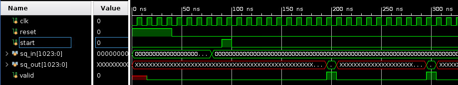

# VDF FPGA Competition Baseline Model

This repository contains the modular squaring multiplier baseline design for the VDF (Verifiable Delay Function) low latency multiplier FPGA competition. For more information about the research behind VDFs see <https://vdfresearch.org/>.

The goal of the competition is to create the fastest (lowest latency) 1024 bit modular squaring circuit possible targeting the AWS F1 FPGA platform. Up to $100k in prizes is available across two rounds of the competition. For additional detail see [FPGA Contest Wiki](https://supranational.atlassian.net/wiki/spaces/VA/pages/36569208/FPGA+Contest) on the [VDF Alliance](https://supranational.atlassian.net/wiki/spaces/VA/overview) page.

Official competition rules can be found in [FPGA_Competition_Official_Rules_and_Disclosures.pdf](FPGA_Competition_Official_Rules_and_Disclosures.pdf).

For a step by step walkthrough of how to get started, with screenshots, see [Getting Started](https://supranational.atlassian.net/wiki/spaces/VA/pages/37847091/Getting+Started).

## Function

The function to optimize is repeated modular squaring over integers. A random input x will be committed at the start of the competition and disclosed at the end of the competition. 

```
h = x^(2^t) mod N

x, N are 1024 bits

t = 2^30

x = random

Decimal:
N = 12406669568412474139879892740481443274469842712573568412813185506
    49768953373091389100150712146576743094431494074574934345790638408
    41220334555160125016331040933690674569571217337630239191517205721
    31019760838723984636436085022089677296497856968322944926681990341
    4117058030106528073928633017118689826625594484331

Hex:
N = 0xb0ad4555c1ee34c8cb0577d7105a475171760330d577a0777ddcb955b302ad0
    803487d78ca267e8e9f5e3f46e35e10ca641a27e622b2d04bb09f3f5e3ad274b1
    744f34aeaf90fd45129a02a298dbc430f404f9988c862d10b58c91faba2aa2922
    f079229b0c8f88d86bfe6def7d026294ed9dee2504b5d30466f7b0488e2666b
```

Here is a sample implementation in Python:
```
#!/usr/bin/python3

from random import getrandbits

# Competition is for 1024 bits
NUM_BITS       = 1024

NUM_ITERATIONS = 1000

# Rather than being random each time, we will provide randomly generated values
x = getrandbits(NUM_BITS)
N = 124066695684124741398798927404814432744698427125735684128131855064976895337309138910015071214657674309443149407457493434579063840841220334555160125016331040933690674569571217337630239191517205721310197608387239846364360850220896772964978569683229449266819903414117058030106528073928633017118689826625594484331

# t should be small for testing purposes.  
# For the final FPGA runs, t will be 2^30
t = NUM_ITERATIONS

# Iterative modular squaring t times
# This is the function that needs to be optimized on FPGA
for _ in range(t):
   x = (x * x) % N

# Final result is a 1024b value
h = x
print(h)
```

## Interface

The competition uses the AWS F1/Xilinx SDAccel build infrastructure described in [aws_f1](docs/aws_f1.md) to measure performance and functional correctness. If you conform to the following interface your design should function correctly in F1 in the provided software/control infrastructure.

The interface is shown in [modular_square/rtl/modular_square_simple.sv](modular_square/rtl/modular_square_simple.sv):

```
module modular_square_simple
   #(
     parameter int MOD_LEN = 1024
    )
   (
    input logic                   clk,
    input logic                   reset,
    input logic                   start,
    input logic [MOD_LEN-1:0]     sq_in,
    output logic [MOD_LEN-1:0]    sq_out,
    output logic                  valid
   );
```



- **MOD_LEN** - Number of bits in the modulus, in this case 1024. 
- **reset** - Reset is active high, as recommended by Xilinx design methodologies.
- **start** - A one cycle pulse indicating that sq_in is valid and the computation should start.
- **sq_in** - The initial number to square, which should be captured at the start pulse. 
- **sq_out** - The result of the squaring operation. This should be fed back internally to sq_in for repeated squaring. It will be consumed externally at the clock edge trailing the valid signal pulse. 
- **valid** - A one cycle pulse indicating that sq_out is valid. 

If you have requirements that go beyond this interface, such as loading precomputed values, contact us by email (hello@vdfalliance.org) and we will work with you to determine the best path forward. We are very interested in seeing alternative approaches and algorithms. 

## Baseline models

Two baseline models are provided for guidance. You can start from either design or create your own that matches the expected interface.

**Simple**

See [modular_square/rtl/modular_square_simple.sv](modular_square/rtl/modular_square_simple.sv). This naive design uses high level operators (a*a)%N to do the computation. While not high performance, it simulates correctly, is easy to understand, and can make for a good starting point.

**Ozturk**

See [modular_square/rtl/modular_square_8_cycles.sv](modular_square/rtl/modular_square_8_cycles.sv). This is an implementation of the multiplier developed by Erdinc Ozturk of Sabanci University and described in detail at [MIT VDF Day 2019](https://dci.mit.edu/video-gallery/2019/5/29/survey-of-hardware-multiplier-techniques-new-innovations-in-low-latency-multipliers-e-ozturk) and in [Modular Multiplication Algorithm Suitable For Low-Latency Circuit Implementations](https://eprint.iacr.org/2019/826). 

There are several potential paths for alternative designs and optimizations noted below. 

## Step 1 - Develop your multiplier

1. Install [Vivado 2018.3](https://www.xilinx.com/support/download/index.html/content/xilinx/en/downloadNav/vivado-design-tools/2018-3.html). To get started you can use a Xilinx WebPack or 30-day trial license. **Extended trial licenses will be made available to registered competitors through Supranational in partnership with Xilinx early in the competition.**
1. Install dependencies:
    ```
    source msu/scripts/simulation_setup.sh
    ```
1. Be sure support for Spartan-7 is included in Vivado. This part should be available with either WebPack or the 30-day trial licenase. To verify:
    * In Vivado, select Help -> Add Design Tools or Devices, then sign in
    * Expand "7 Series", ensure "Spartan-7" is enabled
1. Depending on your approach choose one of the baseline models to start from. Starting Vivado using the `run_vivado.sh` will automatically generate testbench inputs. 

    **Simple**
    ```
    # TO MODIFY: edit modular_square/rtl/modular_square_simple.sv
    #
    cd msu/rtl/vivado_simple
    ./run_vivado.sh
    ```
    
    **Ozturk**
    ```
    # TO MODIFY: edit modular_square/rtl/modular_square_8_cycles.sv
    #
    cd msu/rtl/vivado_ozturk
    ./run_vivado.sh
    ```
1. Run simulations to ensure functional correctness.
    * The provided Vivado model includes a basic simulation testbench.
        * Run vivado (run_vivado.sh)
        * Click Run Simulation->Run Behavioral Simulation
        * The test is self checking and should print "SUCCESS". 
    * The simulation prints cycles per squaring statistics. This, along with synthesis timing results, provides an estimate of latency per squaring.
    * You can also use [verilator](docs/verilator.md) if you prefer by running 'cd msu/rtl; make'. No license required.
1. Run out-of-context synthesis + place and route to understand and tune performance. A pblock is set up to mimic the AWS F1 Shell exclusion zone. In our exprience these results are pretty close to what you will get on F1 and and provide an easier/faster/more intuitive interface for improving the design.
1. Once you have the 30 day trial license you can enable the vu9p part, which is the target of the contest.
    * Help -> Add Design Tools or Devices, sign in
    * Enable "Ultrascale+"
    * In your project, select Settings in the upper left, then "Project device"
    * Select Boards, then select VCU118
1. When you are happy with your design move on to Step 2!

## Step 2 - SDAccel integration

Simulation and synthesis/place and route provide a very good performance estimate. The final determination of performance will be based results from the official AWS F1 SDAccel environment. 

The reasons to go from from synthesis/simulation, which are (relatively) easy, to running on hardware are:
- Ensure the design functions, fits, performs as expected, etc. in F1, the target platform.
- Test correct functionality with many more iterations by running on FPGA hardware.
- Ensure correct operation when techniques such as false paths, multi-cycle paths, etc. are used. These are very difficult to very in simulation alone.

**SDAccel projected performance**

Synthesis/P&R in SDAccel uses automatic frequency scaling to provide feedback on the highest achievable clock frequency. After bitstream generation look for a message like the following in the output logs:
```
INFO: [XOCC 60-1230] The compiler selected the following frequencies for the 
runtime controllable kernel clock(s) and scalable system clock(s): System 
(SYSTEM) clock: clk_main_a0 = 250, Kernel (DATA) clock: clk_extra_b0 = 161, 
Kernel (KERNEL) clock: clk_extra_c0 = 500
```
* This indicates a frequency of 161 MHz for the RTL kernel.
* To estimate squarer latency, multiply the inverse of the frequency by cycles per squaring. Given 8 cycles per squaring, `(1/161)*8*1000 = 49.7ns`.
* Providing clock frequency target guidance to the synthesis tools through the "kernel_frequency" option in `msu/rtl/sdaccel/Makefile.sdaccel` will likely reduce runtime and improve the overall result.

**Testing in SDAccel**

There are three ways to test your design in SDAccel:
1. **Test portal** - The easiest way is to submit your design to the test portal. It will run simulations, hardware emulation, synthesis, and place and route and provide you with a link to the results. You'll need to officially register for the competition and receive a shared secret to submit designs. See [test portal](docs/test_portal.md). **Note we expect this to be operational after the first month of the competition.**
1. **AWS F1** - Instantiate an AWS EC2 F1 development instance and run the flows yourself. See [aws_f1](docs/aws_f1.md).
1. **On-premise** - You can install SDAccel on-premise and run the same flows locally. See [on-premise](docs/onprem.md).

## Step 3 - Submit

1. Fill in the [FPGA_Competition_Application_Form.pdf](FPGA_Competition_Application_Form.pdf) and email to hello@supranational.net, if you haven't already. 
1. Fill in the [Submission_Form.txt](Submission_Form.txt). This stays in the repository and helps convey design expectations.
1. Invite 'simonatsn' from Supranational to collaborate on your design repository in github.

## Optimization Ideas

The following are some potential optimization paths.

* Try other algorithms such as Chinese Remainder Theorem, Montgomery/Barrett, etc. 
* Shorten the pipeline - we believe a 4-5 cycle pipeline is possible with this design
* Lengthen the pipeline - insert more pipe stages, run with a faster clock
* Change the partial product multiplier size. The DSPs are 26x17 bit unsigned multipliers. The Ozturk modular squaring circuit supports using either 17x17 or 26x17 bit multipliers by changing a define at the top of the file.
* This design uses lookup tables stored in BlockRAM for the reduction step. These are easy to change to distributed memory and there is support in the model to use UltraRAM. For an example using UltraRAM see https://github.com/supranational/vdf-fpga/tree/f72eb8c06eec94a09142f675cde8d1514fb72e60
* Optimize the compression trees and accumulators to make the best use of FPGA LUTs and CARRY8 primitives.
* Floorplan the design.
* Use High Level Synthesis (HLS) or other techniques.

## References

Information on VDFs: <https://vdfresearch.org/>

Xilinx offers a wide array of instructional videos online, including:
  * EC2 F1 Lab: <https://www.youtube.com/watch?v=RvTSyVa6bCw>
  * Synthesis: <https://www.youtube.com/watch?v=lFc3JoiOOa8>
  * Floorplanning: <https://www.youtube.com/watch?v=W8D2WghRR4Y>
  * SDAccel kernel debug: <https://www.youtube.com/watch?v=pmogNAEdkcE>

AWS online documentation:
  * SDAccel Quick Start: <https://github.com/aws/aws-fpga/blob/master/SDAccel/README.md>
  * SDAccel Docs: <https://github.com/aws/aws-fpga/tree/master/SDAccel/docs>
  * Shell Interface: <https://github.com/aws/aws-fpga/blob/master/hdk/docs/AWS_Shell_Interface_Specification.md>
  * Simulating CL Designs: <https://github.com/aws/aws-fpga/blob/master/hdk/docs/RTL_Simulating_CL_Designs.md>

## Offered Resources

**Xilinx Vivado Trial License**

Xilinx has offered to provide contestants with a trial license of Vivado for use in the competition. If you would like to receive an extended trial license please complete an contest entry form and provide the host name and the MAC address of the computer on which you will install the trial license. This information can be e-mailed to hello@vdfalliance.org

**AWS Promotional Credits**

AWS has offered to provide a limited number of promotional credits to contestants who wish to test their designs directly on the AWS F1 infrastructure. To receive promotional credits for testing please complete an entry form, share your preliminary contest entry GitHub with the account "simonatsn", and provide the following information:

First Name:  
Last Name:  
Email:  
AWS Account ID:  
Occupation/ Role:  
Company/ Organization (if applicable):  
Website (if applicable):

The above information can be e-mailed to hello@vdfalliance.org. The GitHub repository that is shared must contain non-trivial changes to the baseline repository and will be open-sourced at the completion of the contest.

## Questions?

Please reach out with any questions, comments, or feedback through any of the following channels:
- Message Board: https://vdfalliance.discourse.group/
- Telegram: [vdfalliance.org](http://vdfalliance.org/telegram)
- E-mail: hello@vdfalliance.org
